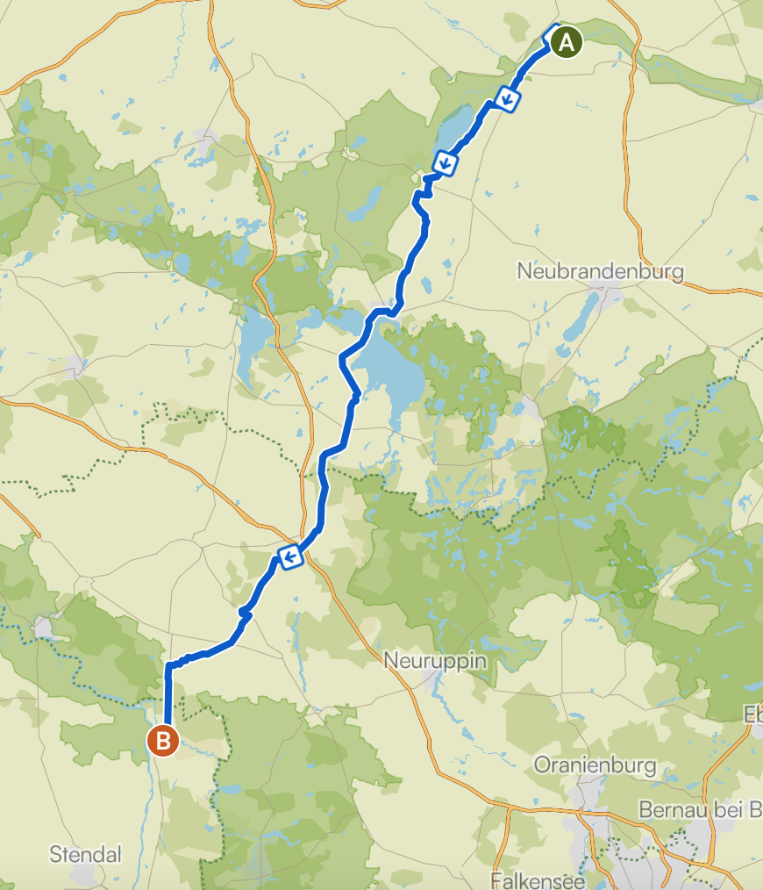

* <a href="https://rainerlueers.github.io/my-tours/">Meine Touren</a>

---
title: Etappenfahrt
---

# Etappenfahrt von Sophienhof nach Quedlinburg endlang des Elberadwegs D10 - 2026
## 22 Mai 2026

**Etappe 01** Sophienhof - Havelberg  
Fr., 22. Mai 2026, 08:00

 |  | 
---------|---------|
Distanz | 179 km | 
Höhenzunahme | 680 m | 
Bewegungszeit (24,5 km/h) | 7h 18min |

  
Etappe 1

[GPX Datei](Sophienhof nach Havelberg.gpx "GPX öffnen")  

___

**Etappe 02** Havelberg - Quedlinburg  
Sa., 23. Mai 2026, 8:00

 |  | 
---------|---------|
Distanz | 160 km | 
Höhenzunahme | 520 m | 
Bewegungszeit (24,5 km/h)| 7h 01min |

  
Etappe 2

[GPX Datei](Havelberg nach Quedlinburg.gpx "GPX öffnen")  

___
