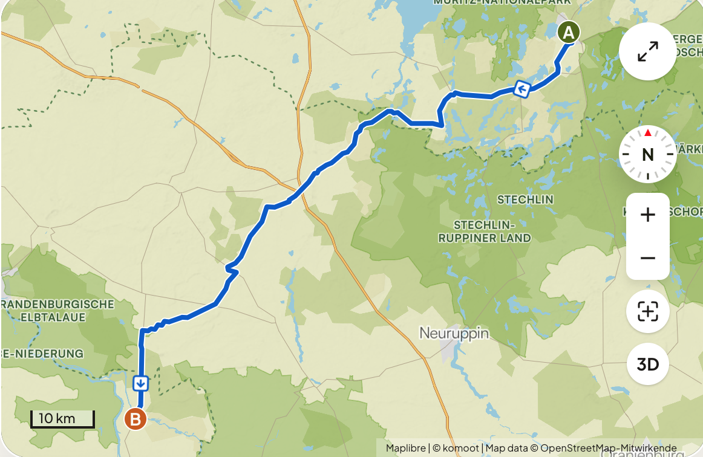
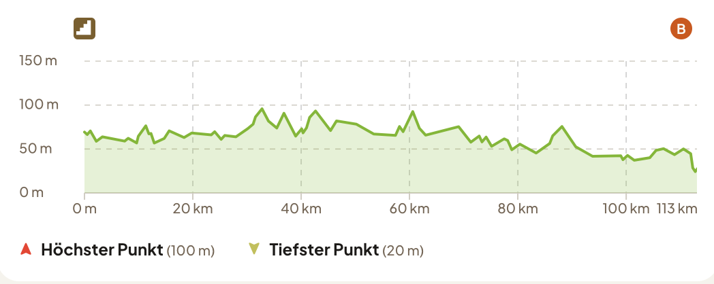
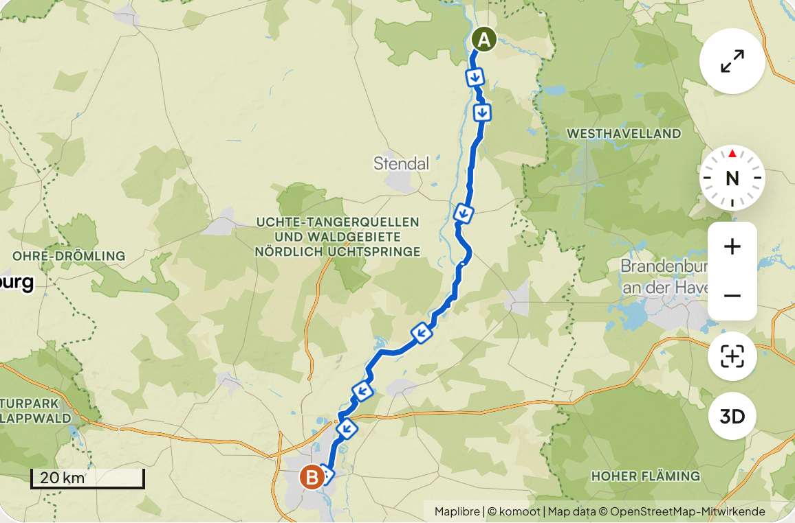
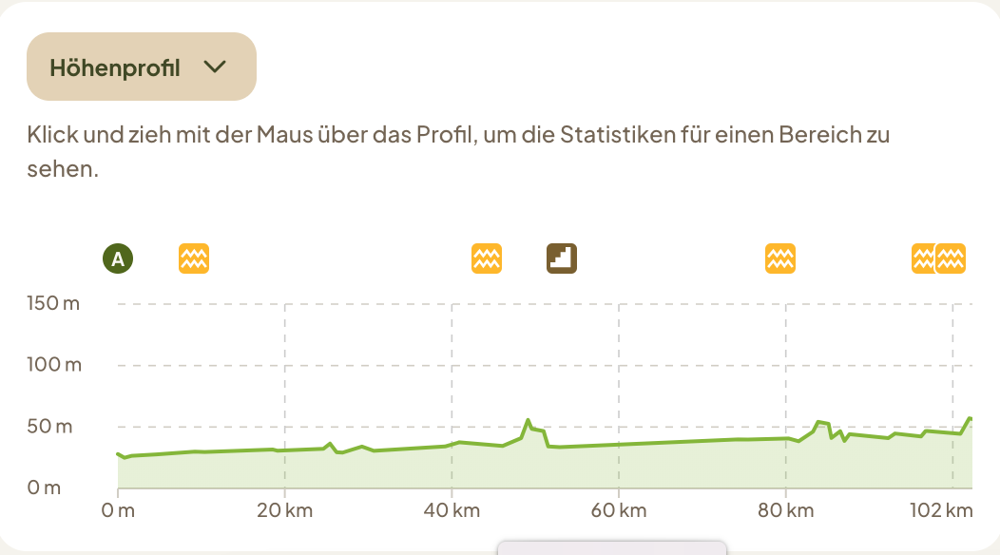
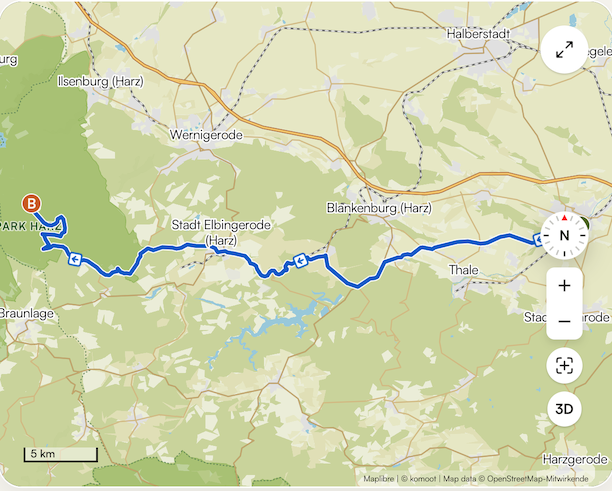
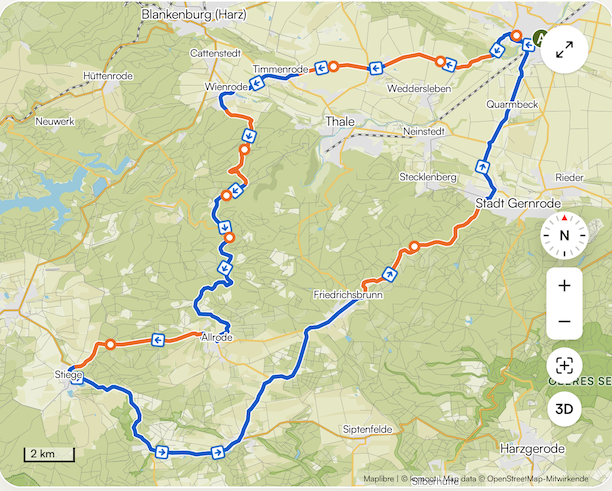
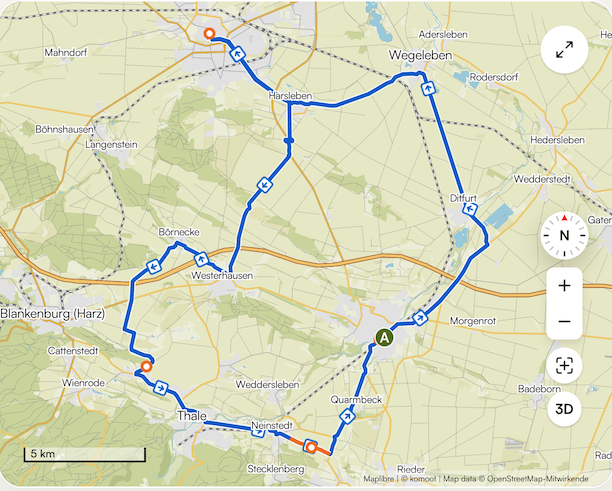
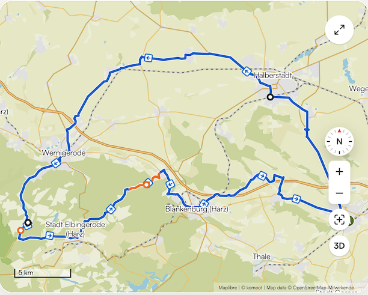
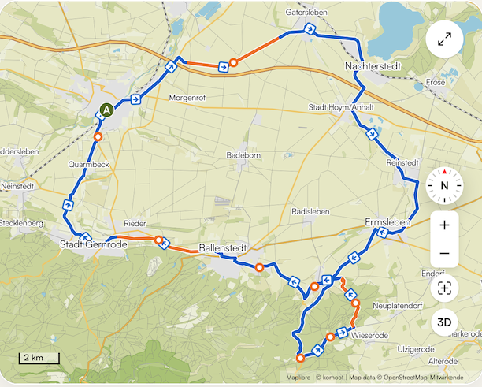
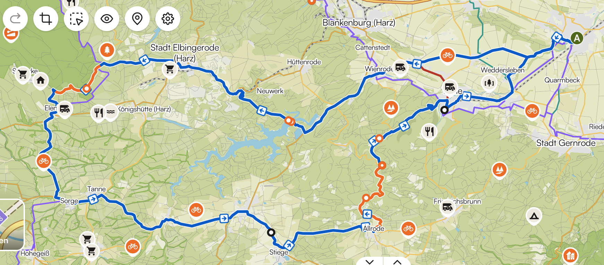

* <a href="https://rainerlueers.github.io/my-tours/">Meine Touren</a>

---
title: Etappenfahrt
---

# Etappenfahrt von Sophienhof nach Quedlinburg - 2026
## 22 Mai 2026

**Etappe 01** Sophienhof - Neustrelitz (Bahnfahrt) 
Neustrelitz - Havelberg (Radfahrt) 
Fr., 22. Mai 2026, 08:00

 |  | 
---------|---------|
Distanz | 113 km | 
Höhenzunahme | 340 m | 
Bewegungszeit (25,2 km/h) | 4h 29min |

  
  
Etappe 1

[GPX Datei](Neustrelitz nach Havelberg.gpx "GPX öffnen")  

___

**Etappe 02** Havelberg - Magdeburg (Radfahrt) 
Magdeburg - Quedlinburg (Bahnfahrt) 
Sa., 23. Mai 2026, 8:00

 |  | 
---------|---------|
Distanz | 102 km | 
Höhenzunahme | 180 m | 
Bewegungszeit (22,7 km/h)| 4h 30min |

  
  
Etappe 2

[GPX Datei](Havelberg nach Magdeburg.gpx "GPX öffnen")  

___

**Tourenplanung - Startpunkt Quedlinburg**

> **Brockengipfel - Hinfahrt**
> 
> <a href="https://www.komoot.com/de-de/tour/2793177455/">Quedlinburg zum Brockengipfel - komoot</a>
>  

>Dauer 02:36

>Distanz 52,6 km

>Tempo 20,3 km/h

>Auffahrt 1.230 m

>Abfahrt 220 m

___
> **Brockengipfel - Rückfahrt**
> 
> <a href="https://www.komoot.com/de-de/tour/2794601845/">Brockengipfel nach Quedlinburg - komoot</a>
>  

>Dauer 01:48

>Distanz 52,6 km

>Tempo 29,3 km/h

>Auffahrt 220 m

>Abfahrt 1.230 m

___
> **Quedlinburg nach Abfahrt von Friedrichsbrunn**
> 
> <a href="https://www.komoot.com/tour/2795270350/">Quedlinburg nach Abfahrt von Friedrichsbrunn - komoot</a>
>  

>Dauer 03:24

>Distanz 70 km

>Tempo 20,5 km/h

>Auffahrt 900 m

>Abfahrt 900 m

___
> **Quedlinburg nach Halberstadt**
> 
> <a href="https://www.komoot.com/tour/2795288518/">Quedlinburg nach Halberstadt - komoot</a>
>  

>Dauer 02:42

>Distanz 62,9 km

>Tempo 23,4 km/h

>Auffahrt 310 m

>Abfahrt 310 m

___
> **Quedlinburg, Halberstadt-Spiegelsberge, Ziegenberg bei Heimburg**
> 
> <a href="https://www.komoot.com/de-de/tour/2796178217/">Quedlinburg, Halberstadt-Spiegelsberge, Ziegenberg bei Heimburg - komoot</a>
>  

>Dauer 04:20

>Distanz 95,8 km

>Tempo 22,1 km/h

>Auffahrt 800 m

>Abfahrt 800 m

___
> **Quedlinburg nach Moorberg-Eichen**
> 
> <a href="https://www.komoot.com/tour/2796191113/">Quedlinburg nach Moorberg-Eichen - komoot</a>
>  

>Dauer 02:55

>Distanz 64,5 km

>Tempo 22,1 km/h

>Auffahrt 430 m

>Abfahrt 430 m

___
> **Thale Hauptbahnhof nach Malerische kurvenreiche Abfahrt im Bodetal**
> 
> <a href="https://www.komoot.com/de-de/tour/2854697693/">Thale Hauptbahnhof nach Malerische kurvenreiche Abfahrt im Bodetal - komoot</a>
>  

>Dauer 04:49

>Distanz 100 km

>Tempo 20,8 km/h

>Auffahrt 1370 m

>Abfahrt 1370 m

___
