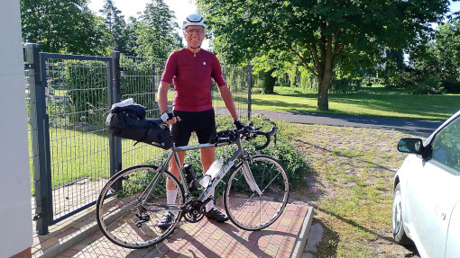
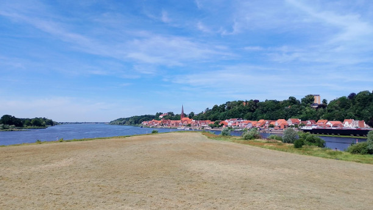
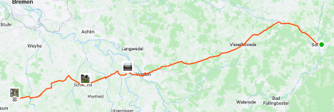

* <a href="https://rainerlueers.github.io/my-tours/">Meine Touren</a>

---
title: Etappenfahrt von Sophienhof nach Lohne
---

# Von der Mecklenburger Seenplatte  bis nach Südoldenburg - 395 km
## 08 Juli 2024

**Etappe 01** Sophienhof - Schwerin  
Mo., 8. Juli 2024, 07:42

 |  | 
---------|---------|
Distanz | 157,09 km | 
Höhenzunahme | 940 m | 
Bewegungszeit | 6h 17min |

  
Startklar in Sophienhof

  
Schloss Schwerin

  
Sophienhof - Schwerin  

___

**Etappe 02** Schwerin - Soltau  
Di., 9. Juli 2024, 08:35

 |  | 
---------|---------|
Distanz | 152,15 km | 
Höhenzunahme | 667 m | 
Bewegungszeit | 6h 8min |

  
Elbe-Lübeck-Kanal mündet in die Elbe

  
Frühstück in Boizenburg

  
Schwerin - Soltau  

___

**Etappe 03** Soltau - Lohne (Groß Bramstedt)  
Mi., 10. Juli 2024, 09:10

 |  | 
---------|---------|
Distanz | 86,23 km | 
Höhenzunahme | 280 m | 
Bewegungszeit | 3h 41min |

  
Aller bei Verden

  
Sattelstütze gebrochen - Erste Rettung !!! Peter !!!

  
Soltau - Lohne (Groß Bramstedt)  

___
