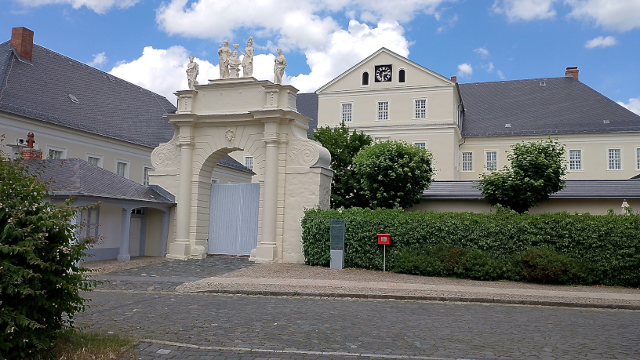
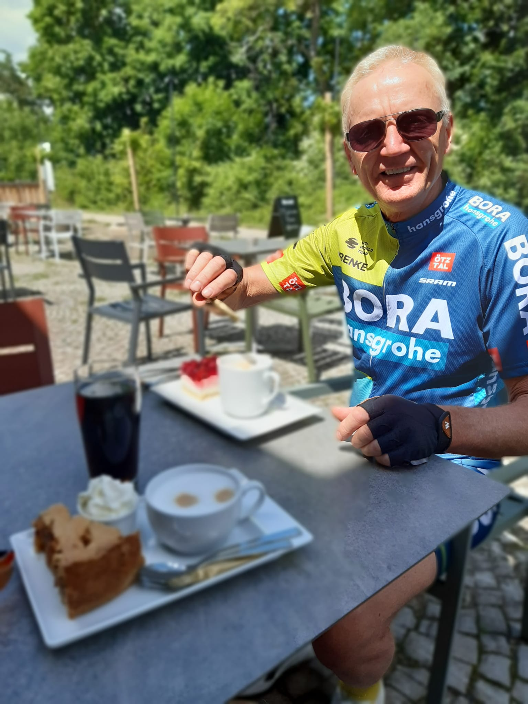
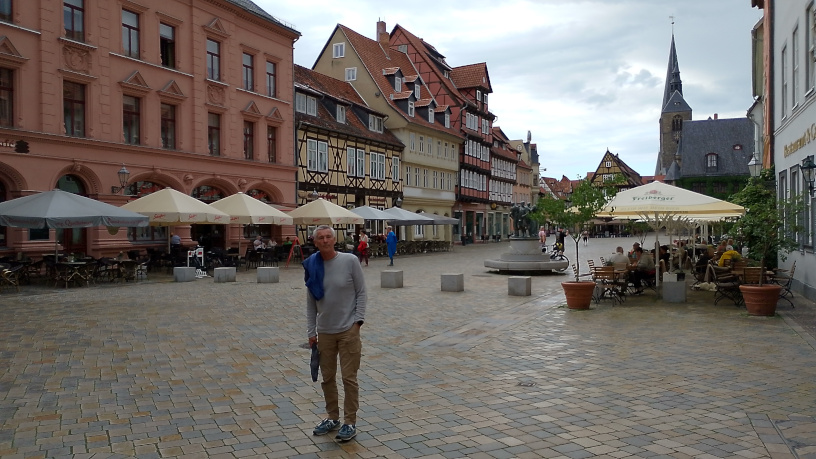
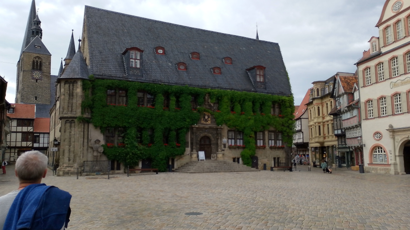
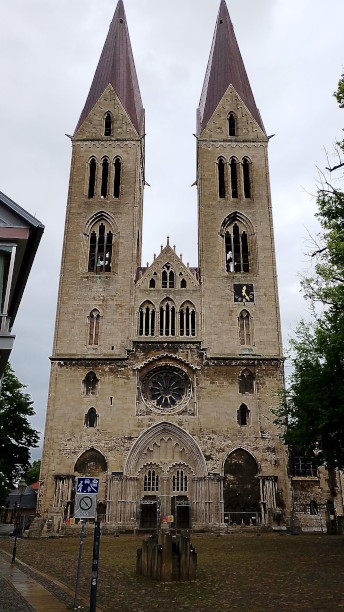
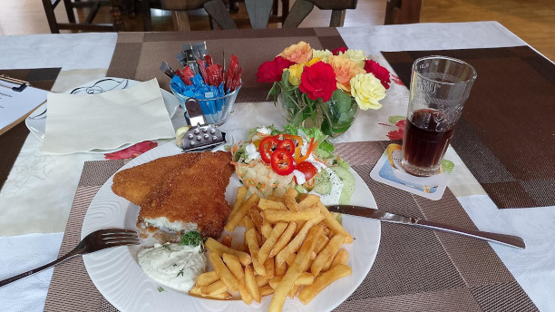
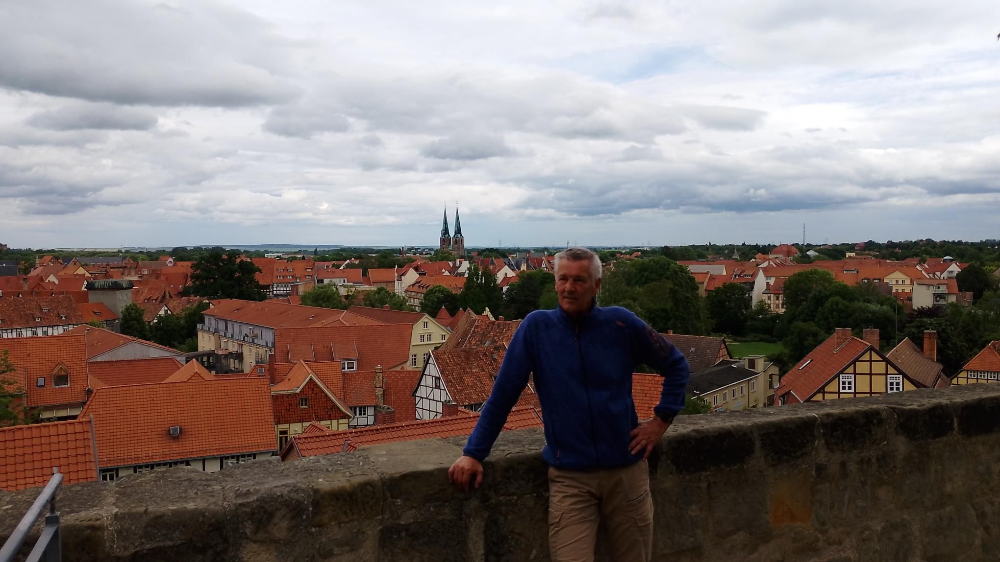

* <a href="https://rainerlueers.github.io/my-tours/">Meine Touren</a>

---
title: Quedlinburg 2024
---

# Urlaub in Quedlinburg  - Harz 2024
## 25 Mai 2024

**Tour 01** Harz - Alter Wasserturm 
So., 26. Mai 2024, 11:00

 |  | 
---------|---------|
Distanz | 60,99 km | 
Höhenzunahme | 408 m | 
Bewegungszeit | 2h 41min |

[GPX Datei](Harz_Alter_Wasserturm.gpx "GPX öffnen")  

  
Stecklenberg
  
Stadt Hoym/Anhalt
  
Pflichtprogramm :-)
  
Herrliche Pizzen
___

**Tour 02** Harz - Stiege, Güntersberge, Friedrichsbrunn, Quedlinburg  
Mo., 27. Mai 2024, 11:23

 |  | 
---------|---------|
Distanz | 71,80 km | 
Höhenzunahme | 929 m | 
Bewegungszeit | 3h 01min |

[GPX Datei](Harz_Stiege_Güntersberge_Friedrichsbrunn_Quedlinburg.gpx "GPX öffnen")  

Anschliessend Spaziergang in der Altstadt

  
Marktplatz Quedlinburg
  
Rathaus Quedlinburg

___

**Tour 03** Harz - Halberstadt, Zilly, Langeln  
Di., 28. Mai 2024, 11:19

... schöne flache Anfahrt zum Anwärmen und ab Schmalkalden 3 ordentliche Anstiege

 |  | 
---------|---------|
Distanz | 76,70 km | 
Höhenzunahme | 539 m | 
Bewegungszeit | 3h 38min |

[GPX Datei](Harz_Halberstadt_Zilly_Langeln.gpx "GPX öffnen")  

  
Dom zu Halberstadt
  
Ritterspiele in Zilly
  
Der Brocken - unerreichbar?! (Blick von Heudeber)

___

**Tour 04** Harz - Vatterode, Wittra Runde 
Do., 30. Mai 2024, 9:28

Solo in den Harz

 |  | 
---------|---------|
Distanz | 106,68 km | 
Höhenzunahme | 1.255 m | 
Bewegungszeit | 4h 18min |

[GPX Datei](Harz_Vatterode_Wittra_Runde.gpx "GPX öffnen") 

...vom Start bis zum Ende Regen 🌧️

  
Nach 60 km Regen verdiente Stärkung
  
Der Schlossherr 😎 hat die Burg verteidigt

___
