* <a href="https://rainerlueers.github.io/my-tours/">Meine Touren</a>

---
title: Rhön 2024
---

# Urlaub in Dermbach  - Rhön und Thüringer Wald 2024
## 4 August 2024

**Tour 01** Sängerwiese - Dermbach - Point Alpha  
So., 4. Aug. 2024, 09:48

Morgen erstmal umritzeln.  
34/25 machen bei 14% keinen Spaß. 
Heini (alte Schule) würde lachen

 |  | 
---------|---------|
Distanz | 69,77 km | 
Höhenzunahme | 1.063 m | 
Bewegungszeit | 3h 2min |

[GPX Datei](Rhön_01_Sängerwiese_Bermbach_Point_Alpha.gpx "GPX öffnen")  

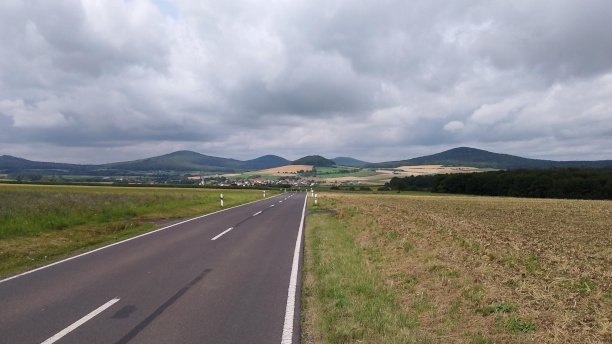  
Blick in die Rhön Richtung Dermbach
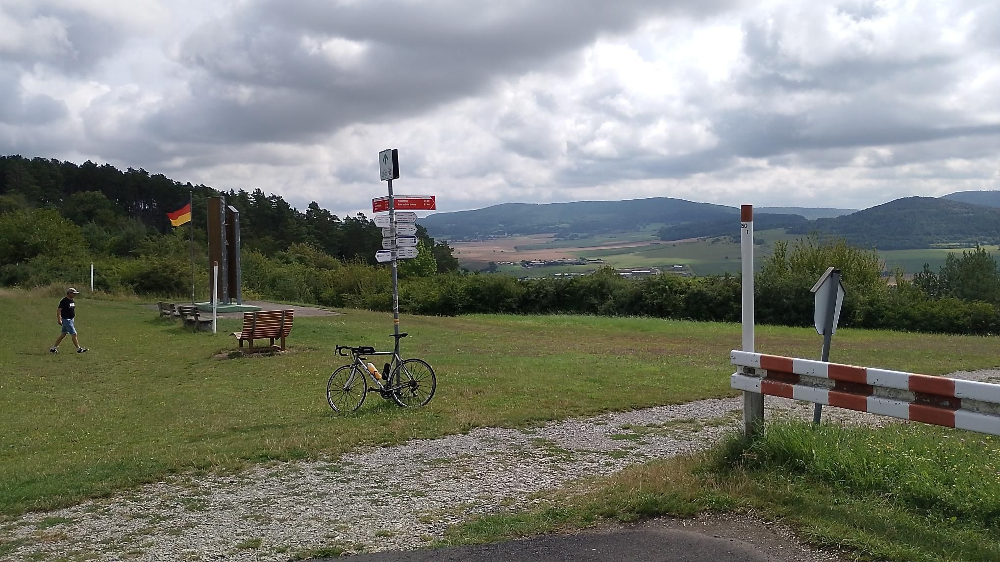 
Point Alpha - Grenze von USA bis 1989 kontrolliert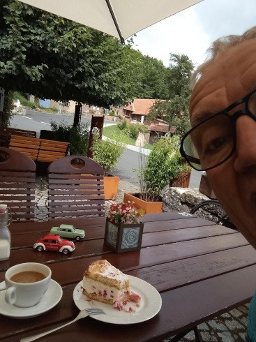  
Stärkung vor dem letzten Anstieg 💪

___

**Tour 02** Vacha Runde - 1 Berg, sonst Flusslauf  
Mo., 5. Aug. 2024, 17:42

...gut für'n Tag nach'm Tag 😚

 |  | 
---------|---------|
Distanz | 63,27 km | 
Höhenzunahme | 597 m | 
Bewegungszeit | 2h 26min |

[GPX Datei](Rhön_02_Vacha_Runde_1_Berg_sonst_Flusslauf.gpx "GPX öffnen")  

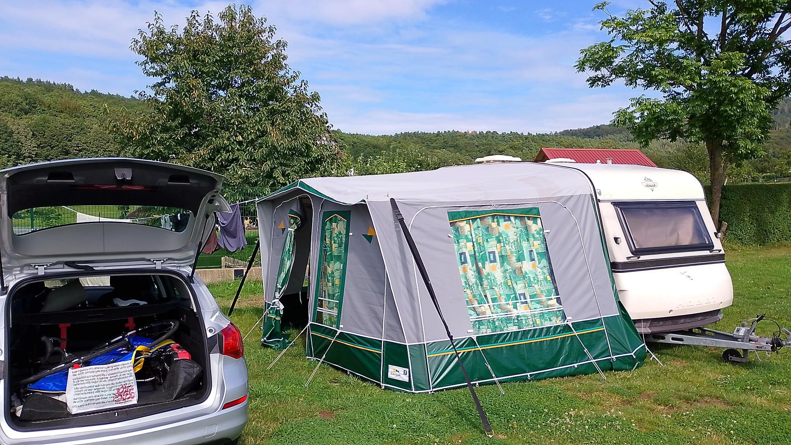  
Mein Domizil ⛺
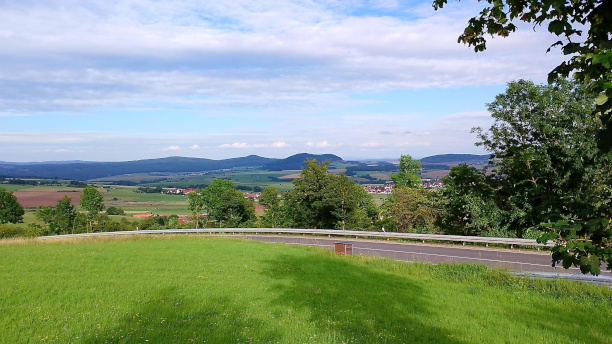 
Heute mein höchster Punkt
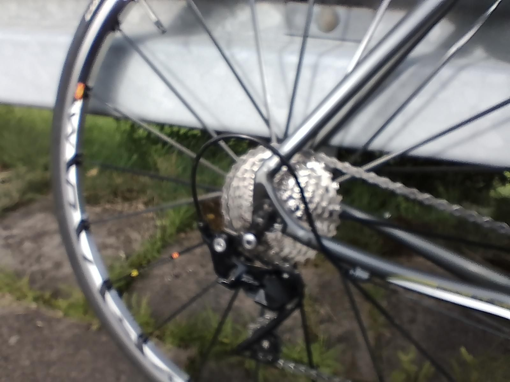  
...darf man ja garnicht zeigen 🥴

___

**Tour 03** Rhön - Schmalkalden - Friedrichroda  
Di., 6. Aug. 2024, 10:59

... schöne flache Anfahrt zum Anwärmen und ab Schmalkalden 3 ordentliche Anstiege

 |  | 
---------|---------|
Distanz | 99,98 km | 
Höhenzunahme | 1.339 m | 
Bewegungszeit | 4h 25min |

[GPX Datei](Rhön_03_Thüringer_Wald_Schmalkalden_Friedrichroda.gpx "GPX öffnen")  

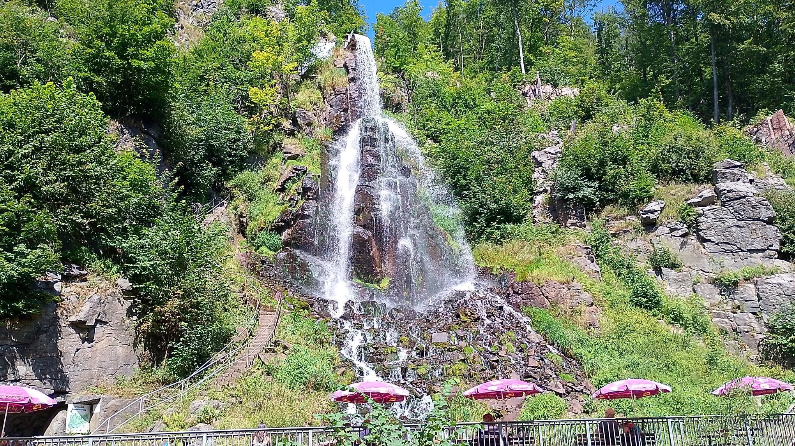  
Trusetaler Wasserfall
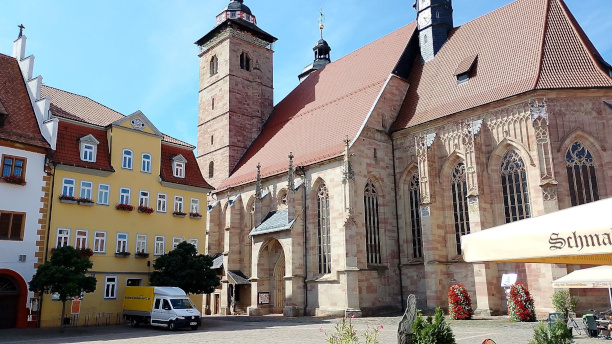 
Stadtkirche St. Georg Schmalkalden

___

**Tour 04** Oberhof  
Do., 8. Aug. 2024, 10:24

...die deutschen Adler fliegen auch im Sommer

 |  | 
---------|---------|
Distanz | 116,86 km | 
Höhenzunahme | 1.324 m | 
Bewegungszeit | 5h 2min |

[GPX Datei](Rhön_04_Thüringer_Wald_Oberhof.gpx "GPX öffnen")  

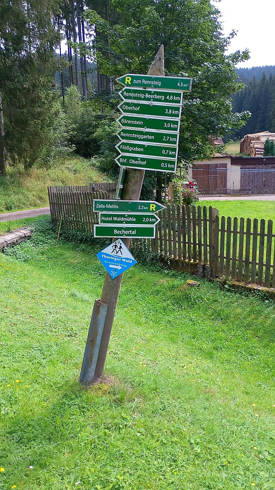  
Richtung Rennsteig 
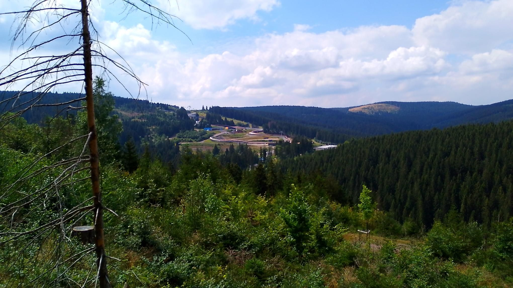  
Rodelbahn Oberhof 

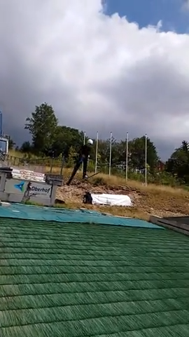  
Jugendtraining des DSV

___

**Tour 05** Rhön - Meiningen Runde  
Fr., 9. Aug. 2024, 11:23

Wind ist das Eine, Berge das Andere, beides zusammen das Besondere

 |  | 
---------|---------|
Distanz | 85,78 km | 
Höhenzunahme | 1.061 m | 
Bewegungszeit | 3h 40min |

[GPX Datei](Rhön_05_Meiningen_Runde.gpx "GPX öffnen")  

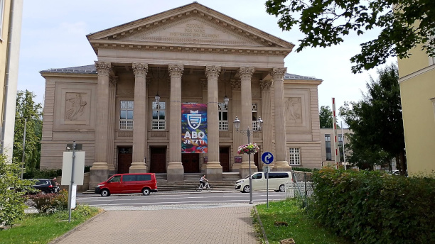  
Staatstheater Meiningen
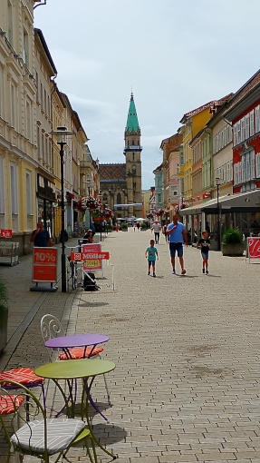  
Altstadt und Fussgängerzone Meiningen
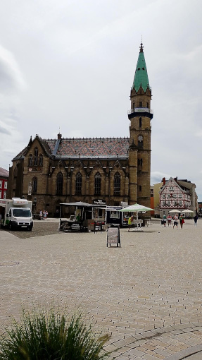 
Stadtkirche Meiningen
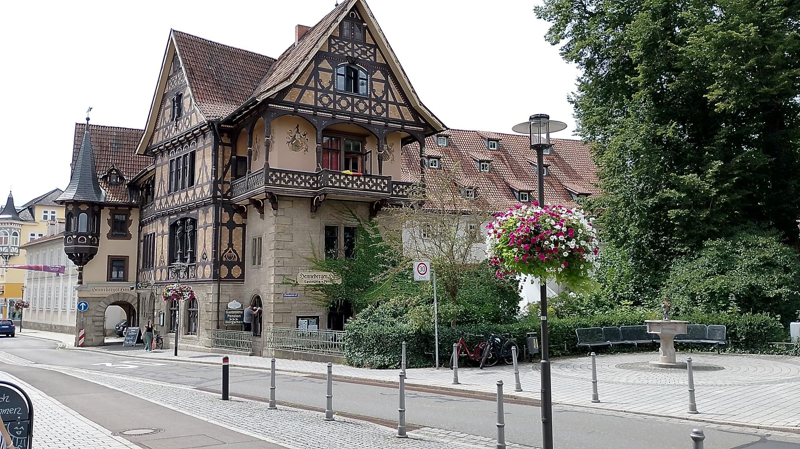 
Ortseingang Meiningen

___

**Tour 06** Rhön - Rund um und rauf auf den Inselberg  
So., 11. Aug. 2024, 09:07

...Inselberg 900 m Kopfsteinpflaster bei satten 12% 😱

 |  | 
---------|---------|
Distanz | 121,84 km | 
Höhenzunahme | 2.002 m | 
Bewegungszeit | 5h 53min |

[GPX Datei](Rhön_06_Rund_um_und_rauf_auf_den_Inselberg.gpx "GPX öffnen")  

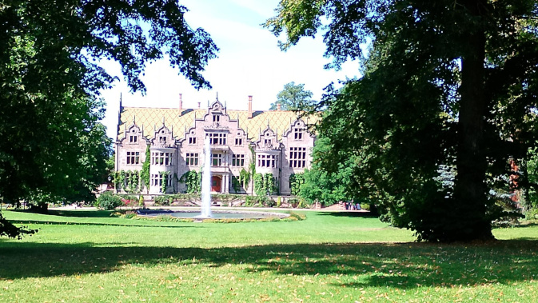  
Schloss Altenstein (ein Juwel) 
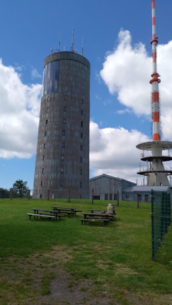  
Funkturm auf dem Inselberg (920m) 
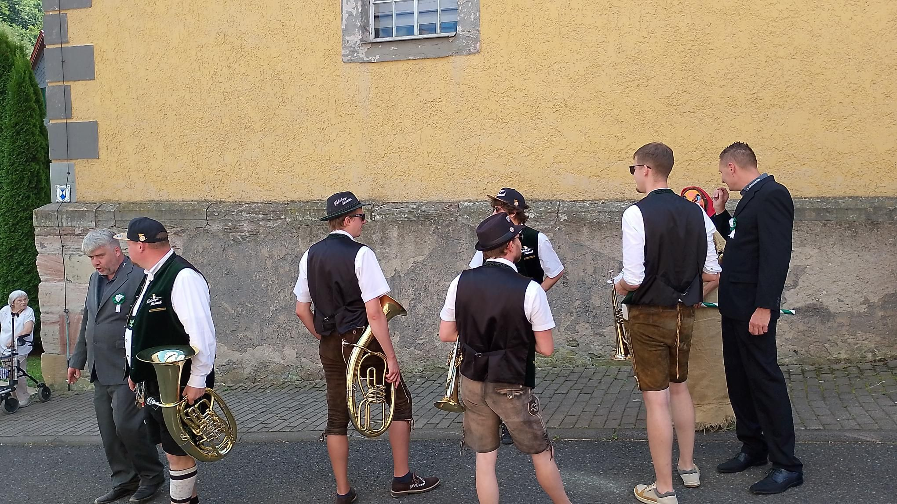  
Kirchweih-Fest (Kirmes)

___
