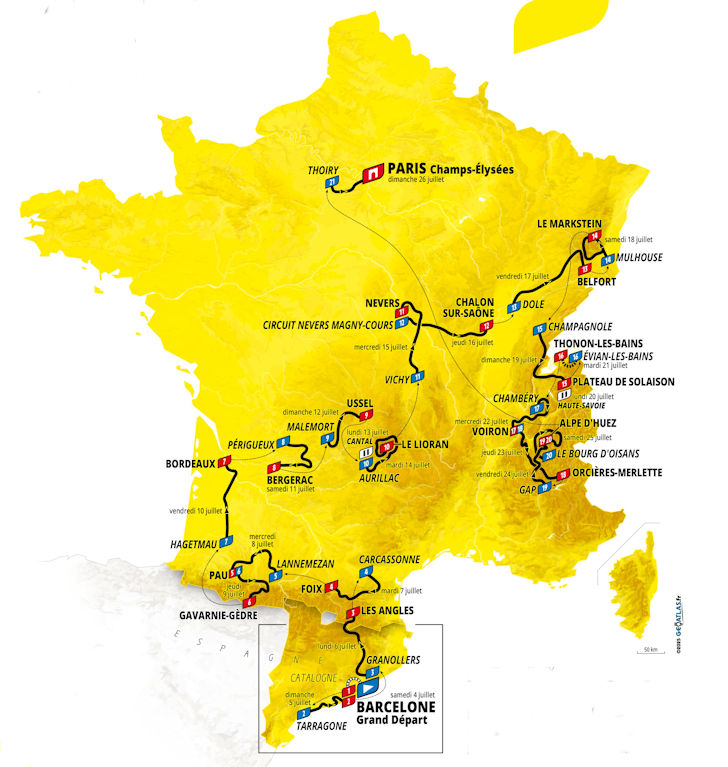

* <a href="https://rainerlueers.github.io/my-tours/">Meine Touren</a>

---
title: Tour de France 2026
---

# Tour de France 2026
## 04.07 - 26.07.2026

 

[Etappe 01](etappe-1-parcours.gpx "GPX Datei öffnen")  

[Etappe 02](etappe-2-parcours.gpx "GPX Datei öffnen")  

[Etappe 03](etappe-3-parcours.gpx "GPX Datei öffnen")  

[Etappe 04](etappe-4-parcours.gpx "GPX Datei öffnen")  

[Etappe 05](etappe-5-parcours.gpx "GPX Datei öffnen")  

[Etappe 06](etappe-6-parcours.gpx "GPX Datei öffnen")  

[Etappe 07](etappe-7-parcours.gpx "GPX Datei öffnen")  

[Etappe 08](etappe-8-parcours.gpx "GPX Datei öffnen")  

[Etappe 09](etappe-9-parcours.gpx "GPX Datei öffnen")  

[Etappe 10](etappe-10-parcours.gpx "GPX Datei öffnen")  

[Etappe 11](etappe-11-parcours.gpx "GPX Datei öffnen")  

[Etappe 12](etappe-12-parcours.gpx "GPX Datei öffnen")  

[Etappe 13](etappe-13-parcours.gpx "GPX Datei öffnen")  

[Etappe 14](etappe-14-parcours.gpx "GPX Datei öffnen")  

[Etappe 15](etappe-15-parcours.gpx "GPX Datei öffnen")  

[Etappe 16](etappe-16-parcours.gpx "GPX Datei öffnen")  

[Etappe 17](etappe-17-parcours.gpx "GPX Datei öffnen")  

[Etappe 18](etappe-18-parcours.gpx "GPX Datei öffnen")  

[Etappe 19](etappe-19-parcours.gpx "GPX Datei öffnen")  

[Etappe 20](etappe-20-parcours.gpx "GPX Datei öffnen")  

[Etappe 21](etappe-21-parcours.gpx "GPX Datei öffnen")  

___

