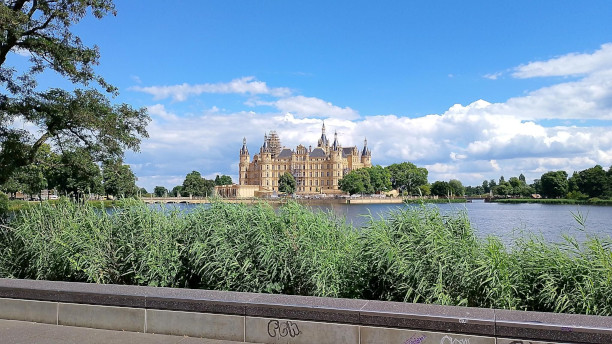
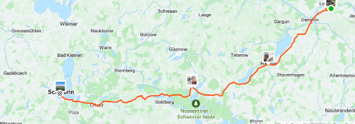
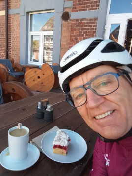
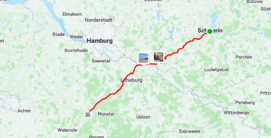
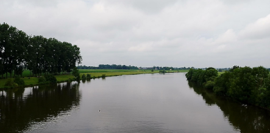
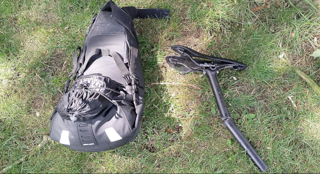

* <a href="https://rainerlueers.github.io/my-bikes/">Meine Räder</a>

---
title: Meine Touren
---

# Eine Auswahl meiner Touren mit Rennrad oder Gravel Bike

Hier stelle ich einige Radtouren zusammen, zu denen es Bildmaterial und
etwas zu erzählen gibt.

## Kleine Schlössertour
### 65 km Rundtour in der Umgebung von Demmin
#### 20 September 2025

  

Ja, die Vielzahl an Schlössern, Guts- und Herrenhäusern ist in dieser Dichte ist in ganz Europa einmalig. 
Allein in Mecklenburg-Vorpommern gibt es ca. 2000 Objekte.
Ich bin in den letzten 3 Jahren mit fast 30000 km Radfahrt im Umkreis von 170 km auf so manch ein Schmuckstück gestoßen. 
Einige Touren hab ich genau für solche Entdeckungen geplant, andere waren eher zufällig.
Nach meinen Recherchen sind die meisten wieder in den Besitz ehemaliger privater Besitzer gegangen 
und je nach Geldbeutel wieder in Stand gesetzt. 

Bei den Häusern im Video weiss ich folgendes:

**Schloss Vanselow**  
gehört wieder der uralten mecklenburgischen Adelsfamilie „von Maltzahn“. 
Denen gehören mehr als 10000 ha Ackerland in unserem direkten Umfeld. Es dient als reines Wohnhaus.

**Schloss Schmarsow**  
wurde vom Politologen und Bildungsforscher Dr. Falk Fabich und der Architektin Andrea Ruiken gekauft und renoviert. 
Dort gibt es 4 Ferienwohnungen. Es gibt Konzerte, Veranstaltungen, Vorträge und Feste können gefeiert werden. 
Kochkurse mit Fokus auf der naturnahen Küche von Dr. Erwin Seitz werden in der Schlossküche angeboten.

**Schloss Broock**  
ist seit Juni 2017 im Besitz der „Schloss Broock GmbH & Co. KG“, also eine Art Verein.
Broock wird zu einem nachhaltigen Zentrum für Tagungen, Kultur und Veranstaltungen ausgebaut.

**Gut Wietzow**  
wurde vom Biotech-Unternehmer Arndt Rolfs (Rostock) und seiner Frau gekauft und renoviert. 
Es ist nahe der Tollense gelegen und hat einen einmalig schönen, fast mystischen Park, in dem das 
kunstinteressierte Ehepaar jährlich open Air Operetten veranstaltet. 
Wir waren 2023 bei Mozarts Treuetest „Cosi fan Tutte“ live dabei :-)

**Schloss Kartlow**  
ist eine absolute Perle. Hier ist der Privateigentümer schwer zu ermitteln. 
Gefunden hab ich „Schloss Cartlow GmbH - Eintragung · Geschäftsführer: Jana Jüstel, Wolfgang Neubert“  
Offenbar steht die Anlage zum Verkauf. Also, nix wie ran :-)

So kann man das monatelang fortführen und wäre immer noch nicht am Ende. 
Das ist auch gut so, denn dann gibt’s noch einiges zu entdecken.  

___

## Etappenfahrt von Sophienhof nach Lohne
### Von der Mecklenburger Seenplatte  bis nach Südoldenburg - 395 km
#### 08 Juli 2024

**Etappe 01** Sophienhof - Schwerin  
Mo., 8. Juli 2024, 07:42

 |  | 
---------|---------|
Distanz | 157,09 km | 
Höhenzunahme | 940 m | 
Bewegungszeit | 6h 17min |

  
Startklar in Sophienhof

  
Schloss Schwerin

  
Sophienhof - Schwerin  

___

**Etappe 02** Schwerin - Soltau  
Di., 9. Juli 2024, 08:35

 |  | 
---------|---------|
Distanz | 152,15 km | 
Höhenzunahme | 667 m | 
Bewegungszeit | 6h 8min |

  
Elbe-Lübeck-Kanal mündet in die Elbe

  
Frühstück in Boizenburg

  
Schwerin - Soltau  

___

**Etappe 03** Soltau - Lohne (Groß Bramstedt)  
Mi., 10. Juli 2024, 09:10

 |  | 
---------|---------|
Distanz | 86,23 km | 
Höhenzunahme | 280 m | 
Bewegungszeit | 3h 41min |

  
Aller bei Verden

  
Sattelstütze gebrochen - Erste Rettung !!! Peter !!!

  
Soltau - Lohne (Groß Bramstedt)  

___